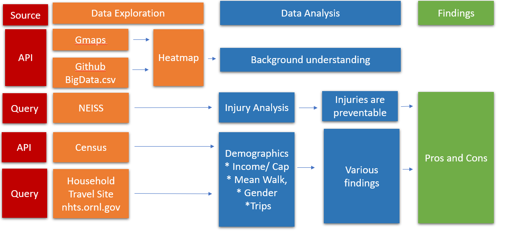
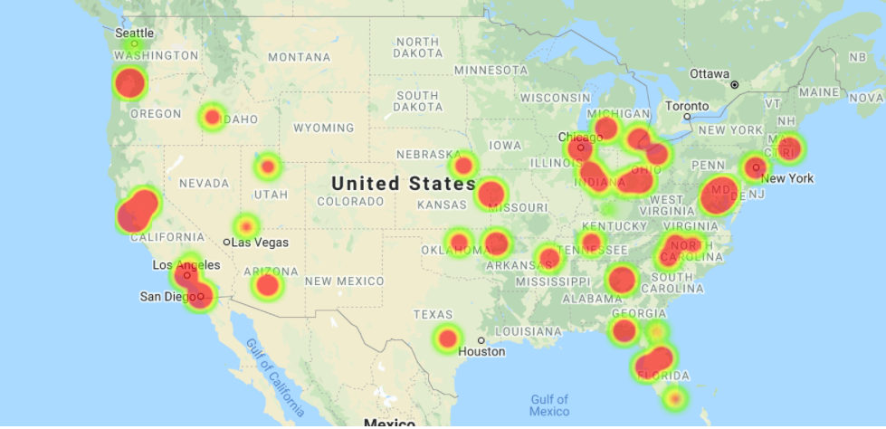
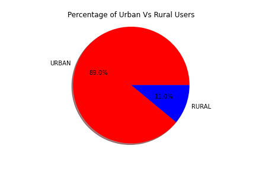
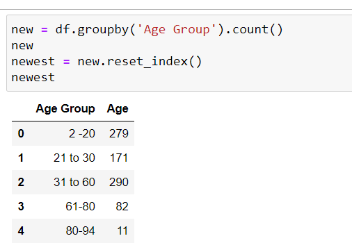
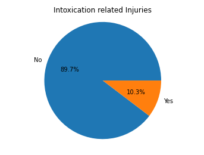
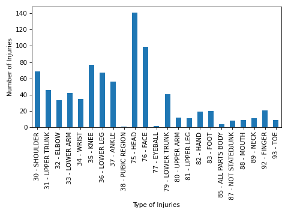
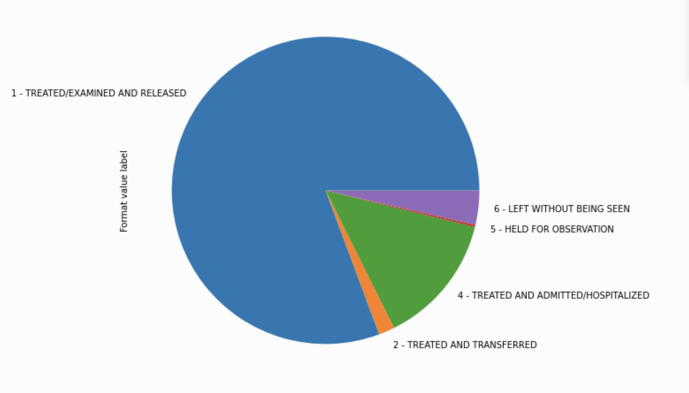

# E-scooters: The Good, The Bad, and The Ugly
## Project Outline
Explore US and Europe e-scooter businesses to understand the correlations between rate of injuries, city demographic, lawsuits, regulations (helmets and age limit) and popularity. Using accessible data on e-scooters, we would like to understand the pros and cons of e-scooters in order to form an educated opinion on whether e-scooters should be banned or expanded and the types of regulations that should be recommended.

## Table of Cotents
* [Team](https://github.com/adriana-icasiano/project-1#Team)
* [Our Questions](https://github.com/adriana-icasiano/project-1#Our-Questions)
* [Workflow](https://github.com/adriana-icasiano/project-1#Workflow)
* [Data Sources](https://github.com/adriana-icasiano/project-1#Data-sources)
* [Data Exploration](https://github.com/adriana-icasiano/project-1#Data-Exploration)
* [Data Analysis](https://github.com/adriana-icasiano/project-1#Data-Analysis)
  * [Demographics](https://github.com/adriana-icasiano/project-1#Demographics)
    * [Population](https://github.com/adriana-icasiano/project-1#Population)
    * [Age](https://github.com/adriana-icasiano/project-1#Age)
    * [Mean Walk Minutes to Work](https://github.com/adriana-icasiano/project-1#Mean-Walk-Minutes-to-Work)
    * [Income per Capita](https://github.com/adriana-icasiano/project-1#Income-per-capita)
    * [Trip Duration](https://github.com/adriana-icasiano/project-1#Average-Trip-Distances/Durations-and-Trip-Reasons-by-Bikes,Segways/Scooters-and-Walk)
    * [Gender](https://github.com/adriana-icasiano/project-1#gender)
    * [Urban vs Rural](https://github.com/adriana-icasiano/project-1#urban-vs-rural)
    * [Injuries](https://github.com/adriana-icasiano/project-1#injuries)
* [Findings](https://github.com/adriana-icasiano/project-1#Injuries)
* [Conclusion](https://github.com/adriana-icasiano/project-1#Conclusion)

## Team
1) Harlan Brasek  
2) Adriana Icasiano  
3) Emily Leniart 
4) Saumya Pandey 
5) Rasaq Sule-Odu 

## Our Questions

Faced with the rapid growth of e-scooters, local governments from Europe and US are faced with important regulatory questions. Local government responses to the above pros and cons vary from banning to piloting e-scooter programs to expansion. Many developed new regulations to cope with the problems.

1) Should e-scooters be banned or expanded?  
2) What is the demographic of cities where e-scooters are currently used?  
3) What is the average distance and time traveled via e-scooters? 
4) What are the injuries related to e-scooters?  
5) What type of regulations alleviate the problems? 
6) What can e-scooter rental/ sellers do to alleviate the problems? 

## Workflow

## Data Sources
### APIs
>1) Gmaps  
>2) [NABSA (
North American Bike Share Association)  - GBFS (General Bikeshare Feed Specification)](https://github.com/NABSA/gbfs/blob/master/systems.csv)
>3) Census demographic data  

### Queries

>1) [Consumer Product Safety Commission (CPSC) - NEISS (National Electronic Injuries Surveillance System) Query](https://www.cpsc.gov/cgibin/NEISSQuery/UserCriteria.aspx?UserAff=5x08cgz9T6YPDAZJzvlZjA%3d%3d&UserAffOther=9OYR9kUytIsLilKZieD5xg%3d%3d)  
>2) [National Household Travel Survey](https://nhts.ornl.gov/)

## Data Exploration
Use Google to search for a “Lime API”
Found a github account for NABSA ( North American Bike Share Association) - GBFS (General Bikeshare Feed Specification) 
Obtained a csv file with a list of API addresses for certain cities.
To get started we first used data available from BIRD cities. We used the Latitude/Longitude coordinates to get the number of scooters in each city throughout the US. Generated a heatmap  for a better visualization depicting the distribution of BIRD scooters around the US.  
The code can be found here.
[the code](https://github.com/adriana-icasiano/project-1/blob/main/DATA/bird-us-cities/starter_escoot_project.ipynb)

The heatmap is as follows.

Retrieved for geocodes for available e-scooters
Using gecodes, retrieved the cities names from gmaps.
Generated heatmap using cities, geocodes and bike counts.
 

We also created a layered markers to understand the geographical distribution of each operator using the sample codes from gmaps. From here we exported the gmaps to a html so that we can view the gmaps figure externally if we wanted to.
 

For the age data, we had to download a large series for files as we could only download data for each individual state 
 
In order to sort through this, we had to loop through the files to create a single CSV 
 

The CSV for additional census data from Kaggle had to be narrowed down to the counties we needed to investigate. 
One issue is states share county names so we had to elimate the ones that we did not need, otherwise the analysis would be inaccurate. 
We ended up going from 4000 rows to around 230 and then down to the 60 that we needed. 
 

## Data Analysis

### Demographics
#### Population 
Data Source: Census.gov 
A comparison of the populations between counties where Lime operates and the entire US.  The average for Lime is higher and the upper bound for the entire US does not even touch the first quantile for Lime 

 

#### Age
Data Source: Census.gov 
The range in ages is very different for Lime counties.  There is a larger cluster of people in their twenties and thirties living in counties where Lime operates 

 

#### Mean Walk Minutes to Work
Data Source: Census.gov 
From the 2000+ counties where Lime e-scooters are used, we randomly sampled 50 counties for plotting. Of 50 randomly sampled counties, the mean walking minutes to work for each county varies from 0.1 minute to 9.7 minute, with an exception of one county (23.5 minute). 

#### Income per Capita
Data Source: Census.gov 
From the 2000+ counties where Lime e-scooters are used, we randomly sampled 50 counties for plotting. Of 50 randomly sampled counties, the Income Per Capita by County varies between $7,887 to $44,683. Similar to other public transport system, it is priced at a affordable rate and serves a broad population. 

#### Average Trip Distances/Durations and Trip Reasons by Bikes,Segways/Scooters and Walk

Data Source: National Household Travel Survey 
(National household Travel Survey, which offers a nationally representative sample of how tens of thousands of U.S. individuals got around on a given day. It offers a National Representative Sample of how thousands of US citizens commute.)

Due to the limited datsaset available for the scooters I combined these mini modes(biking, segways and scooters data) for my analysis.
Using a combined travel data is justified as
a)they travel roughly at the same speed.
b)they all are supposed to be green modes of transport
c)and ofcourse are dangerous/out of place in both sidewalks as well as in heavily traffic roads.
The graph provides the time and distance traveled by bike, walk, and segway/e-scooters, and indicates that the time the use of e-scooters is lowest.E-scooters are use for short trips and intermediary transport to groceries, and train station. 
 
We found out that on an average vehicle trip distance for segways/scooters were not more than 5 miles and for bike its 3 miles. The trip duration indicates that the max trip duration ranges from 20 min in case of bikes to 10 min in case of scooters. Most of the people use these micromobilty devices to do short distance travels, getting meals, going to work, running errands, getting groceries.  
 
 

[The Code ](https://github.com/adriana-icasiano/project-1/blob/main/DATA/demographic/demographic.ipynb)
##### Takeaway
These micromobility devices can really cutshort the small automobile trips and thereby help in reducing carbon emiison.

#### Gender
Data Source: National Household Travel Survey 
Another  standout pattern we found was  that Men are twice as likely than  women( 67 and 33) to use these micromobilty devices. One of the possible reasons for Women to shy away from embracing these devices is safety which could be attributed to the lack of proper bike lanes.  

##### Major takeaway: Working on the infrastructure can improve the success of these esccoters.
[The Code ](https://github.com/adriana-icasiano/project-1/blob/main/DATA/demographic/demographic.ipynb)
#### Urban vs Rural
Data Source: National Household Travel Survey 

Unsurprisingly, our finding also indicated that there is more success of these micromobilty devices in urban as opposed to rural areas.
[The Code ](https://github.com/adriana-icasiano/project-1/blob/main/DATA/demographic/demographic.ipynb)

### Injuries 
Data Source: National Electronic Injuries Surveillance System (NEISS)  

 
 

#### Intoxication Related Injuries

Isolating the injuries relating to intoxication shows a surprisingly small percentage. This suggests that setting the age limit higher to avoid young drinkers causing injuries would be ineffective.

#### Types of Injuries

Breaking down the injuries by injured area, it is immediately clear that the head and face are injured the most, just like with riding bikes. This suggests that regulators should require those riding e-scooters to wear helmets, just as they do for bikes.

#### Disposition of Injuries

E-scooter rides who get hurt and seek medical or other attention are treated, examined, and released the vast majority of time; therefore, the mortality rate due to e-scooters is extremely low.

## Findings
### The use of scooters resembles the use of public transportation for short distance and local travels based on the following findings:
>1) Demographics of cities that use e-scooters differ from the rest of the US.
>2) Average distance traveled ~5 miles
>3) Average Time Duration ~20 mins.
>4) Mean walking minutes to work between 0.1 to 10 minutes.
>5) Income per capita varies
### Injuries are preventable with proper regulations.
### Percentage of women user is lower than men users due to safety concerns.
### What can government and companies do to address safety issues?
#### Injuries
1. Limit riding on scooter/bike lanes
2. Set curfew 
3. Require helmets
4. Display warning about injuries

#### Gender gap in usage of e-scooter
> Companies should focus on a safer design for women to ensure safety

## Conclusion
With productive and thoughtful government regulations, the pros of e-scooter use outweigh the cons.
